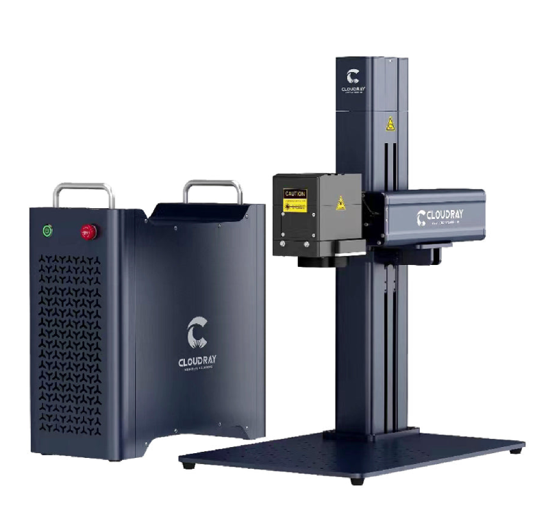
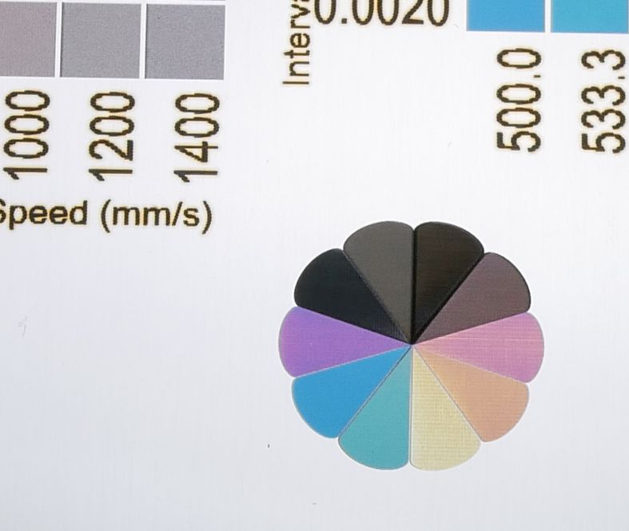
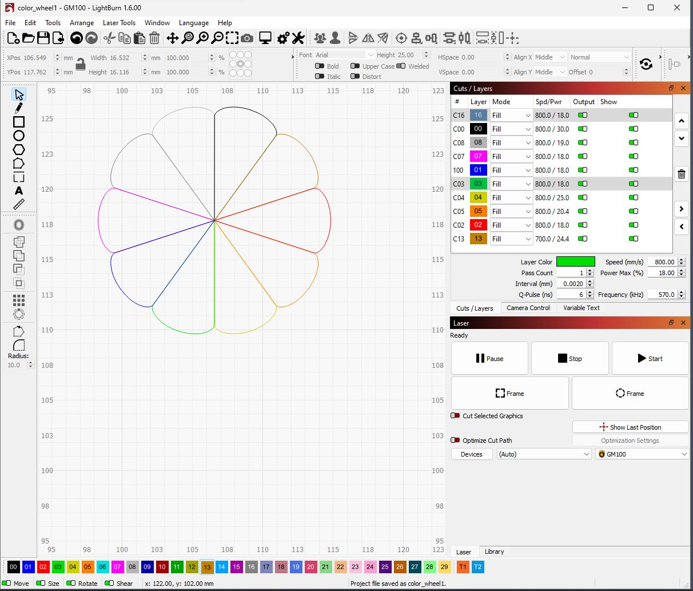
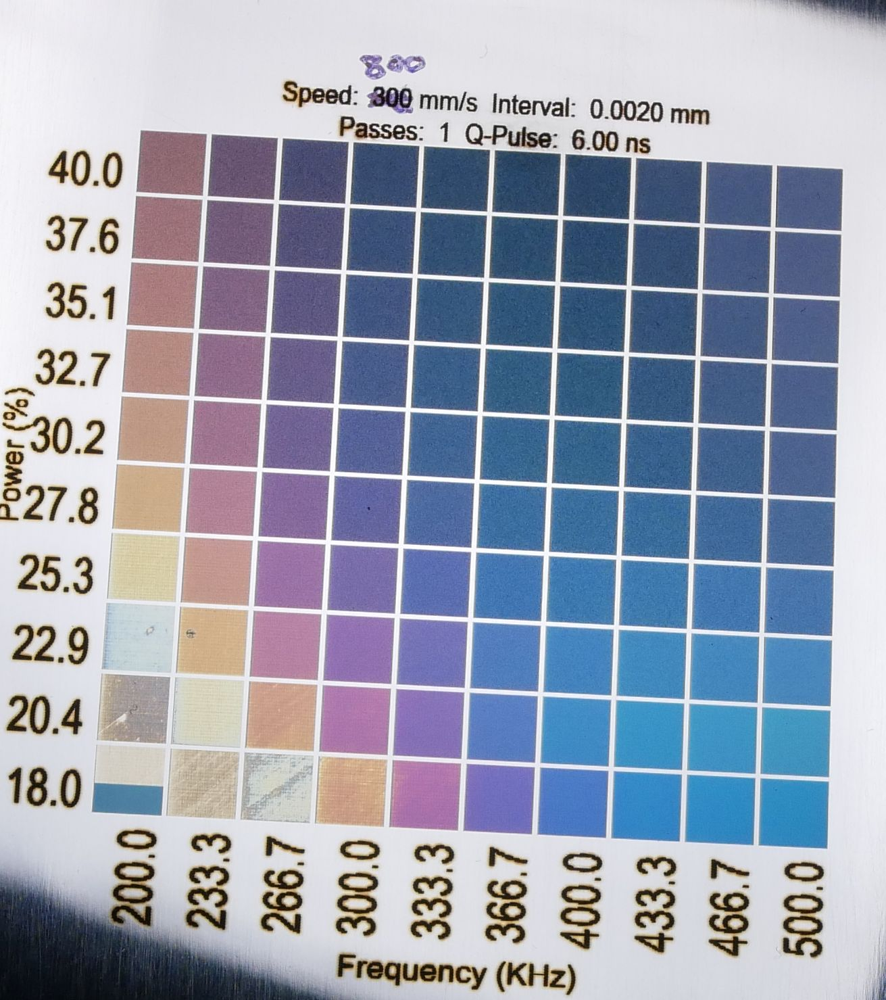
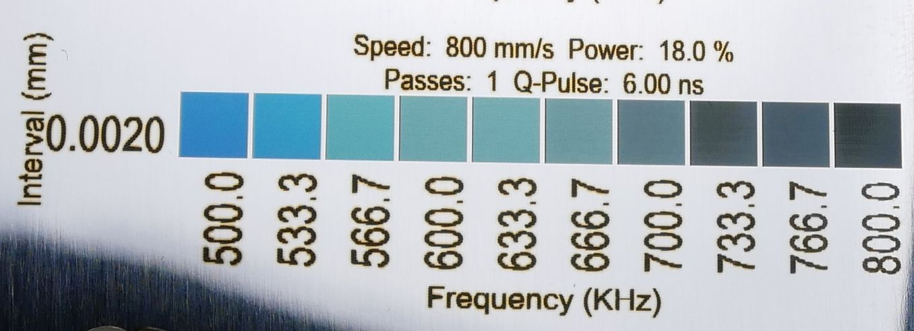
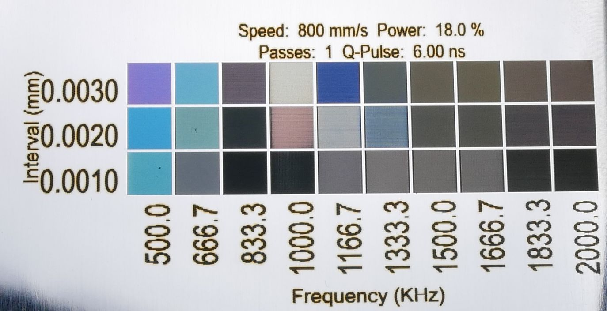
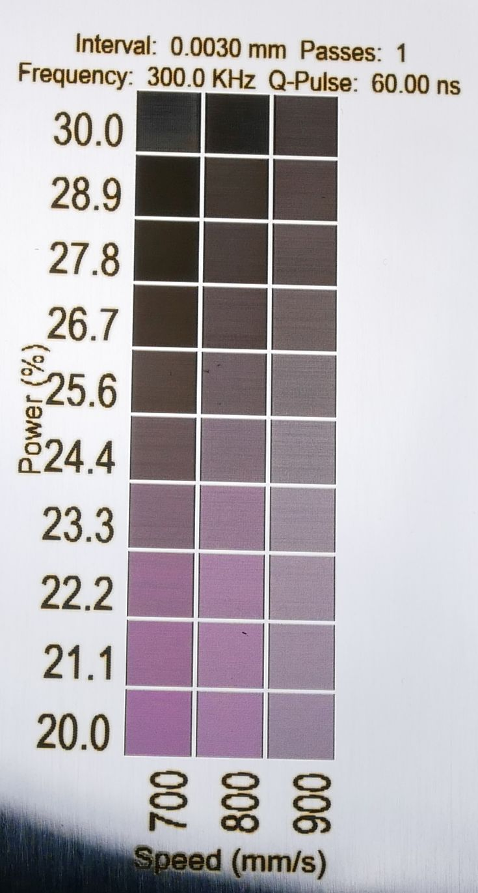

# MOPA_Laser_Stainless_Colors
MOPA laser settings to make colorful oxide layers on stainless steel

I used a Cloudray GM100 MOPA laser engraver with 290mm focal length F-theta lens :  https://www.cloudraylaser.com/products/cloudray-gm-100-litemarker-100w-fiber-laser-marking-engraver-with-4-3-x-4-3-scan-area?variant=43545779830945

All substrates are polished stainless steel. .048"  (1.2mm) is great because it doesn't warp much.  .036" (0.9mm) is acceptable, but thinner metal has a lot of problems with warping.   https://www.mcmaster.com/9785K12/   https://www.mcmaster.com/9785K13/     I used a vacuum chuck to hold the sheet metal flat while engraving:  https://www.ebay.com/itm/276754053418  https://www.clampusystems.com/product-category/vacuum-tables/sg-vacuum-table-series/

For a 100W JPT M7 laser  (Cloudray GM100)

         Speed (mm/s) /  Power (%)  /  Pulse length (ns)  /  Frequency (KHz)  /  Interval (mm)
         
Black  800 / 30 / 60 / 300 / .003

White  800 / 19 / 6 / 1500 / .003

Gray   800 / 18 / 6 / 1000 / .001

Purple 800 / 18 / 6 / 367 / .002

Blue   800 / 18 / 6 / 500 / .002

Green  800 / 18 / 6 / 570 / .002

Yellow 800 / 25 / 6 / 200 / .002

Orange 800 / 20.4 / 6 / 266 / .002

Red    800 / 18 / 6 / 333 / .002

Brown  700 / 24.4 / 60 / 300 / .003

6ns pulse length swatches

Green color swatches

Interval swatches

Red swatches

